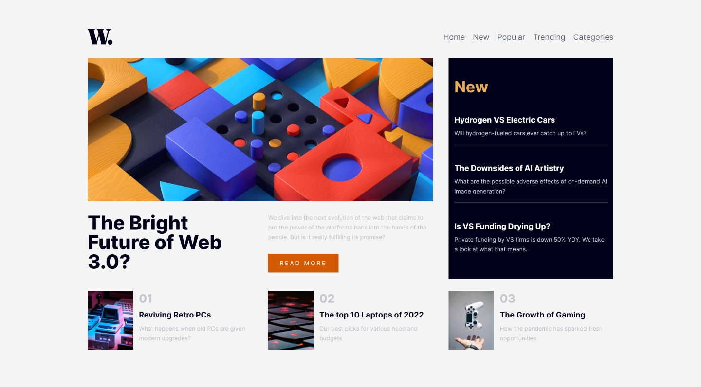

## Table of contents

- [Overview](#overview)
  - [The challenge](#the-challenge)
  - [Screenshot](#screenshot)
  - [Links](#links)
- [My process](#my-process)
  - [Built with](#built-with)
  - [What I learned](#what-i-learned)
  - [Continued development](#continued-development)
  - [Useful resources](#useful-resources)
- [Author](#author)
- [Acknowledgments](#acknowledgments)

## Overview

### The challenge

Users should be able to:

- View the optimal layout for the interface depending on their device's screen size
- See hover and focus states for all interactive elements on the page

### Screenshot

#### Desktop Versions :- <br>




#### Desktop Versions


 - Representing the Sticky navigation bar.


### Links

- Solution URL: [GitHub](https://github.com/Halleys123/news-homepage-frontendmentor)
- Live Site URL: [Netlify](https://frabjous-eclair-e1682a.netlify.app/)

## My process

### Built with

- Semantic HTML5 markup
- CSS custom properties
- Flexbox
- CSS Grid
- Desktop-first workflow

### What I learned

This project was helpful for learning how to use media querries in javascript using

```js
window.matchMedia("(max-width: 768px)");
```

It also helped in learning how to effectively plan out the design and code html accordingly for faster workflow.

## Author

- Frontend Mentor - [@Halleys123](https://www.frontendmentor.io/profile/Halleys123)
- Twitter - [@Halleys123](https://twitter.com/ArnavChhabra3)
- LinkedIn - [Arnav C.](https://www.linkedin.com/in/arnav-c-51072316b/)
- GitHub - [Halleys123](https://github.com/Halleys123)
